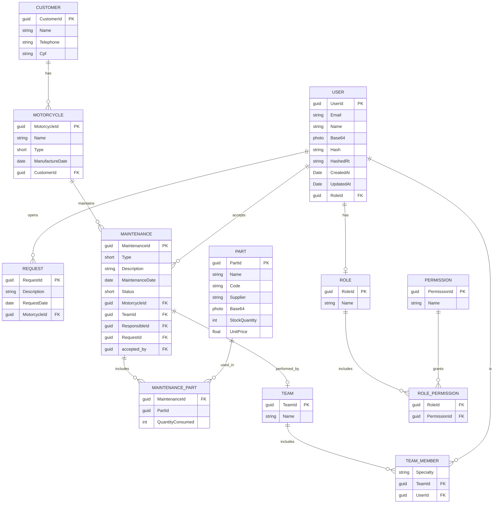

```mermaid

erDiagram
    CUSTOMER {
        guid CustomerId PK
        string Name
        string Telephone
        string Cpf
    }
    MOTORCYCLE {
        guid MotorcycleId PK
        string Name
        short Type
        date ManufactureDate
        guid CustomerId FK
    }
    REQUEST {
        guid RequestId PK
        string Description
        date RequestDate
        guid MotorcycleId FK
    }
    MAINTENANCE {
        guid MaintenanceId PK
        short Type
        string Description
        date MaintenanceDate
        short Status
        guid MotorcycleId FK
        guid TeamId FK
        guid ResponsibleId FK
        guid RequestId FK
        guid accepted_by FK
    }

    MAINTENANCE_PART {
        guid MaintenanceId FK
        guid PartId
        int QuantityConsumed
    }

    PART {
        guid PartId PK
        string Name
        string Code
        string Supplier
        photo Base64
        int StockQuantity
        float UnitPrice
    }
    TEAM {
        guid TeamId PK
        string Name
    }
    TEAM_MEMBER {
        string Specialty
        guid TeamId FK
        guid UserId FK
    }
    USER {
        guid UserId PK
        string Email
        string Name
        photo Base64
        string Hash
        string HashedRt 
        Date CreatedAt
        Date UpdatedAt
        guid RoleId FK
    }
    ROLE {
        guid RoleId PK
        string Name
    }
    PERMISSION {
        guid PermissionId PK
        string Name
    }
    ROLE_PERMISSION {
        guid RoleId FK
        guid PermissionId FK
    }

    CUSTOMER ||--o{ MOTORCYCLE : has
    MOTORCYCLE ||--o{ MAINTENANCE : maintains
    MAINTENANCE ||--o{ MAINTENANCE_PART : includes
    PART ||--o{ MAINTENANCE_PART : used_in
    MAINTENANCE ||--o| TEAM : performed_by
    TEAM ||--o{ TEAM_MEMBER : includes
    USER ||--o{ REQUEST : opens
    USER ||--o{ MAINTENANCE : accepts
    USER ||--o{ TEAM_MEMBER : is
    USER ||--o| ROLE : has
    ROLE ||--o{ ROLE_PERMISSION : includes
    PERMISSION ||--o{ ROLE_PERMISSION : grants
```